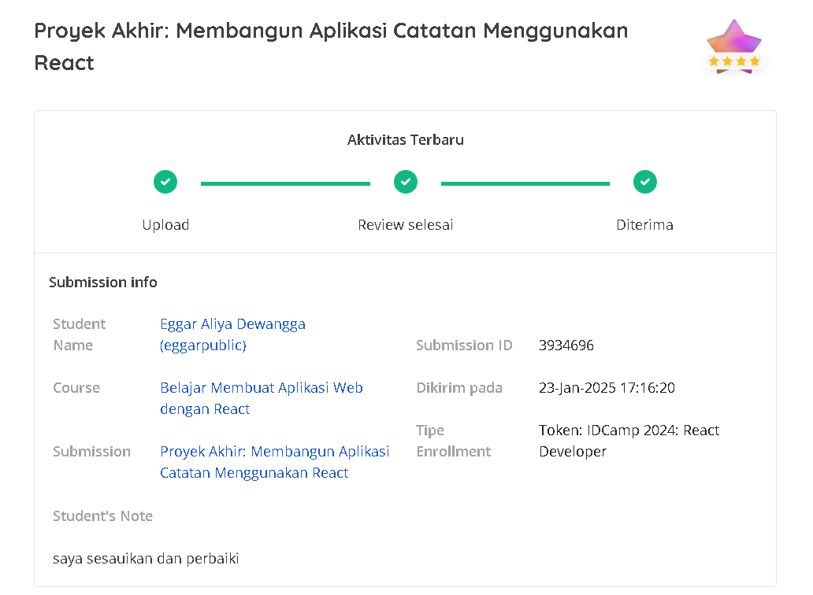

# Proyek Akhir: Membangun Aplikasi Catatan Menggunakan React



## Deskripsi Proyek
Aplikasi Catatan Pribadi adalah sebuah aplikasi berbasis web yang memungkinkan pengguna untuk membuat, mengelola, dan mencari catatan dengan mudah. Fitur tambahan seperti pengarsipan dan batasan karakter judul menjadikan aplikasi ini lebih modern dan bermanfaat.

---

## Fitur Utama

1. **Menampilkan Daftar Catatan**
   - Catatan ditampilkan dalam daftar yang rapi.
   - Menggunakan state untuk menyimpan data catatan.
   - Teknik map digunakan untuk merender catatan.

2. **Menambahkan Catatan Baru**
   - Pengguna dapat menambahkan catatan dengan judul dan isi.
   - Data catatan disimpan dalam memori (tidak persisten).
   - Struktur data catatan:
     ```javascript
     {
       id: number | string,
       title: string,
       body: string,
       archived: boolean,
       createdAt: string,
     }
     ```
   - Terdapat limit 50 karakter untuk judul, dengan indikator jumlah karakter tersisa.

3. **Menghapus Catatan**
   - Catatan dapat dihapus dengan menekan tombol hapus.
   - Jika tidak ada catatan, aplikasi akan menampilkan pesan "Tidak ada catatan".

4. **Fitur Pencarian Catatan**
   - Pengguna dapat mencari catatan berdasarkan judul.
   - Jika kolom pencarian kosong, seluruh catatan akan ditampilkan.

5. **Fitur Arsip Catatan**
   - Catatan dapat diarsipkan dan dipindahkan kembali ke daftar aktif.
   - Catatan aktif dan arsip ditampilkan secara terpisah.

---

## Teknologi yang Digunakan
- **React**: Library JavaScript untuk membangun antarmuka pengguna.
- **React Icons**: Untuk menampilkan ikon modern di aplikasi.
- **CSS**: Untuk gaya visual dan responsivitas aplikasi.

---

## Struktur Direktori
```
.
├── public
│   ├── 1.png                
├── src
│   ├── components           # Komponen React
│   │   ├── NoteInput.jsx    # Form untuk menambahkan catatan
│   │   ├── NoteItem.jsx     # Komponen individu untuk catatan
│   │   ├── NoteList.jsx     # Menampilkan daftar catatan
│   │   ├── SearchBar.jsx    # Input pencarian catatan
│   ├── utils
│   │   ├── data.jsx         # Data awal catatan
│   │   ├── date.jsx         # Fungsi format tanggal
│   ├── styles
│   │   ├── style.css        # Gaya aplikasi
│   ├── App.js               # Komponen utama aplikasi
├── README.md                # Dokumentasi proyek
```

---

## Instalasi dan Menjalankan Proyek

1. Clone repositori ini:
   ```bash
   git clone https://github.com/username/repository-name.git
   ```

2. Masuk ke direktori proyek:
   ```bash
   cd repository-name
   ```

3. Instal dependensi:
   ```bash
   npm install
   ```

4. Jalankan aplikasi:
   ```bash
   npm run dev
   ```

5. Akses aplikasi di browser:
   ```bash
   [npm run dev](http://localhost:5173/)
   ```

## Kontributor
- Eggar AliyaDewangga - Pengembang utama aplikasi.


## Lisensi
Proyek ini dilisensikan di bawah lisensi MIT. Silakan lihat berkas `LICENSE` untuk detail lebih lanjut.

